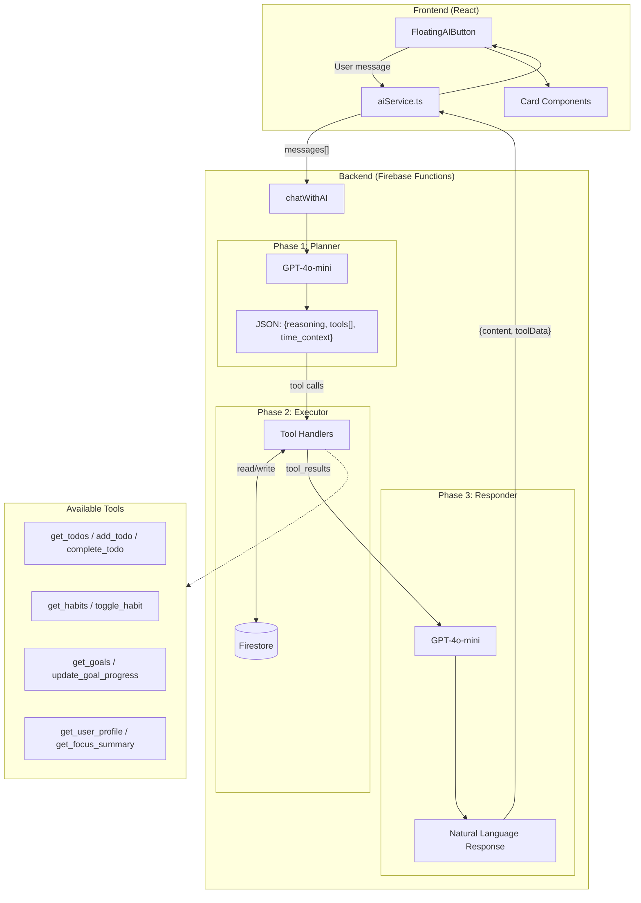

# LLM Architecture

## Overview

The AI uses a **three-phase orchestration pattern**:

1. **Planner** (gpt-4o-mini) - Analyzes user intent and decides which tools to call
2. **Executor** - Backend runs the selected tools against Firestore
3. **Responder** (gpt-4o-mini) - Generates a natural language response with the results

## Architecture Diagram

## Key Files

| File | Purpose |
|------|---------|
| `src/services/aiService.ts` | Frontend service calling Firebase function |
| `src/components/layout/FloatingAIButton.tsx` | Chat UI component |
| `functions/main.py` | Backend orchestration (3-phase flow) |
| `functions/prompts.py` | System prompts for planner/responder |
| `functions/tools.py` | 9 tool handlers (get_todos, add_todo, etc.) |
